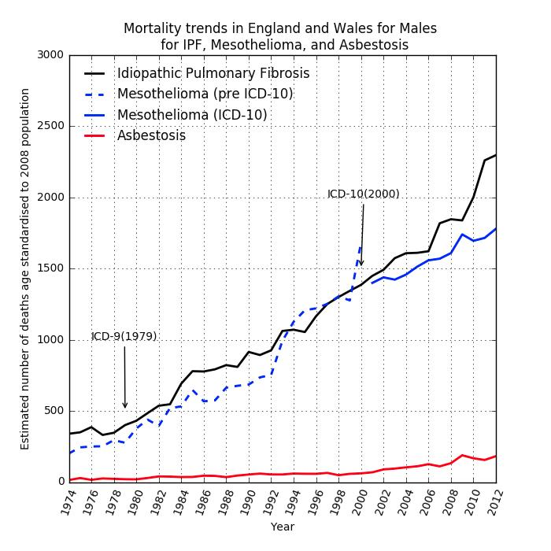
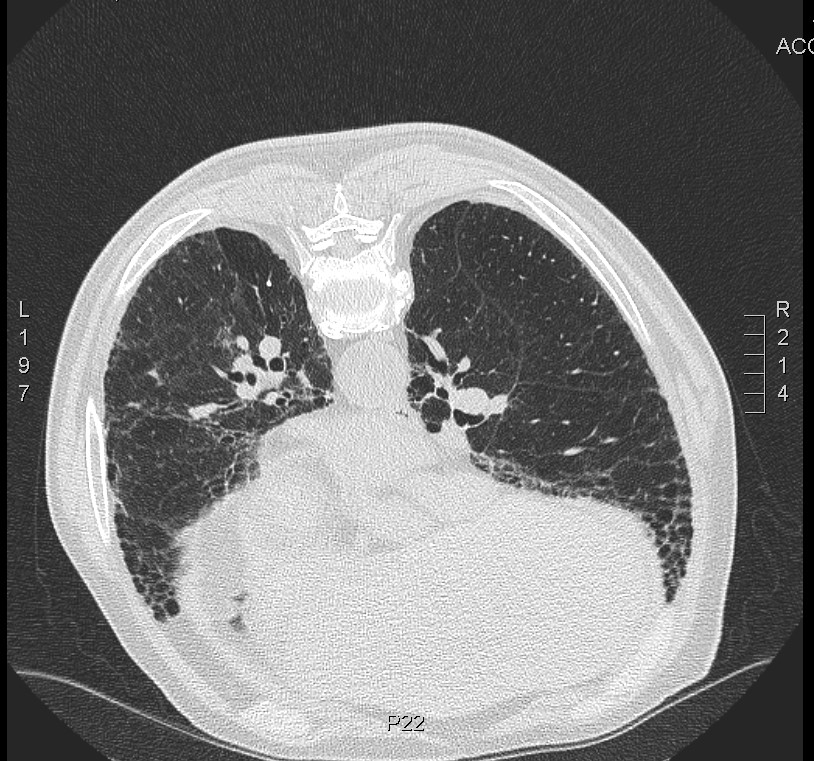
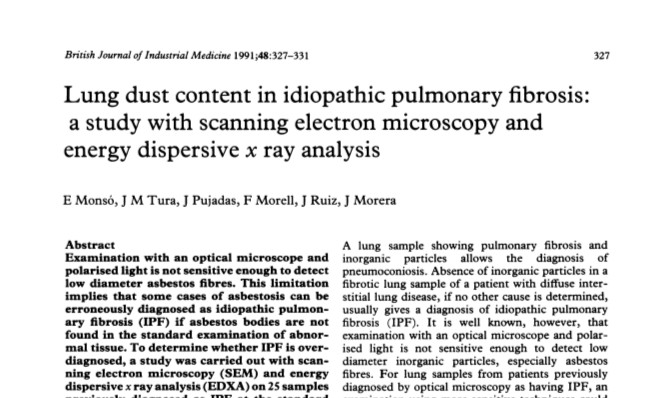

% ESA Presentation
% Dr Carl Reynolds 

# Is occupational asbestos exposure an under-recognised cause of IPF?

##

the question is not new; it arises because it is clinically plausible, epidemiologically plausible, and consistent with
fibre studies and case-control data

## 

- clinical presentation can be similar
- radiologically and histopathologically both give rise to UIP - no differentiating biomarkers
- doctors may not elicit previous asbestos exposure and patients may not recall it
- unclear what dose is needed

## 

- IPF more common in men, manual workers, those living in industrial regions
- correlation with asbestos imports (Barber et al. 2015)
- correlation with asbestos related disease, cohort effect

##

{ width=65% }

##

{ width=65% }

## Seen in the clinic

##

CT request: 80 year old man, soboe, fine creps, asbestos exposure. 

## 

{ width=65%  }

##

"There is extensive coarse reticular shadowing most marked in the lower lobes but extending also into the upper lobes. There are calcified pleural plaques over the left hemidiaphragm. No other abnormality noted.

The parenchymal changes are more **suggestive of IPF rather than asbestos-related interstitial lung disease** although I cannot exclude this."

##

He worked as industrial lagger in power stations and railways for 40 years. Wife has pleural plaques. 

## Fibre studies and case-control data

## 

##

- 14 case-control studies
- most use community controls (with poor response rates)
- most use self-reported exposure measures; none quantify asbestos exposure
- occupational overlap with mesothelioma case-control studies e.g metal-plate workers
- associations with common asbestos co-exposures e.g metal and wood dust 

##

I carried out a meta-analysis of previous case-control studies; pooled PAF estimates by exposure category (metal, wood, agricultural dust, stone, VGDF) ranged from 4 to 14\% 

##

| Exposure          | Risk estimates (n) | Pooled OR (95% CI) | Pooled PAF \% (95% CI) |
|-------------------|--------------------|--------------------|------------------------|
| Metal dust        | 10                 | 1.4 (1.3-1.7)      | 8 (6-10)               |
| Wood dust         | 11                 | 1.7 (1.3-2.2)      | 4 (3-5)                |
| Stone dust        | 9                  | 1.7 (1.3-2.3)      | 7 (5-9)                |
| Agricultural dust | 6                  | 1.8 (1.0-3.1)      | 9 (6-12)               |
| VGDF*             | 8                  | 1.6 (1.3-1.9)      | 14 (12-17)             |

# Does it matter? 

##

- it's bad to not know the cause of a killer disease that is becoming more common
- there is ongoing asbestos exposure globally 
- there is reason to think some IPF is due to asbestos, if this is the case we can better understand and prevent IPF globally

# What's IPFJES? 

## 

- (another) hospital-based case-control study
- lifetime occupational histories combined with occupational proportionate mortality ratios for mesothelioma and a job-process based asbestos exposure assessment
- blood test for susceptibility genetics to investigate gene-exposure interactions
- basically a telephone-interview + blood test for 920 patients at 16 centres
  
##

- funded by Wellcome Trust and in the NIHR portfolio; all regulatory approvals in place
- registered [clinicaltrials.gov NCT03211507](https://clinicaltrials.gov/ct2/show/NCT03211507)
- full study documentation online at [www.ipfjes.org](http://ipfjes.org/)

# Progress to date

##

since starting in October 2016 I have obtained REC, HRA, and local R&D approvals, finalised study documentation, developed computer assisted interview software, built a study website, appointed a research assistant, carried out training in asbestos exposure assessment, carried out site initiation visits, and recruited and interviewed participants

# Areas of concern

##

recruitment, recruitment, recruitment 

##

- [19 organisations](https://batchgeo.com/map/3fe51a6c9576af5379b7cb7604ce9b82) are participating
- 13 site visits have taken place
- 12 C&Cs have been recieved
- 5 centres have recruited at least one participant

##

| PI                     | Organisation                                      | Participants           |
|------------------------|---------------------------------------------------|------------------------|
| Lisa Spencer           | Aintree University Hospital                       | 17                     |
| Nazia Chaudhuri        | University Hospital of South Manchester           | 6                      |
| Carl Reynolds          | Imperial College                                  | 4                      |
| Huzaifa Adamali        | North Bristol                                     | 2                      |
| Owen Dempsey           | Aberdeen Royal                                    | 2                      |

# Plans

##

- get other centres up and running
- add centres
- more training
- get it done

# Any questions?

##

- <carl.reynolds@imperial.ac.uk> 
- [drcjar](https://twitter.com/drcjar) | [ipfjes](https://twitter.com/ipfjes)
- [www.carlreynolds.net](http://carlreynolds.net/) | [www.ipfjes.org](http://ipfjes.org/)

